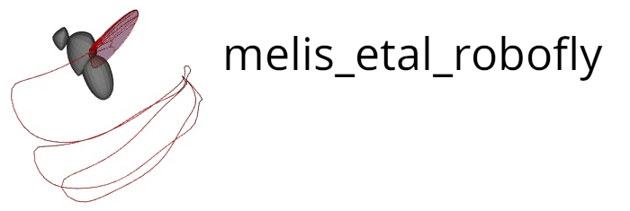

Software and Jupyter notebook with robofly data analysis for Melis,
Siwanowicz, and Dickinson 2024.

### System Requirements

Tested on ubuntu 22.04 with Python 3.11.4

### Dependencies
The complete list of software dependencies can be found in the "dependencies"
section of the pyproject.toml file. All of the dependencies will be
automatically installed by the Package Installer for Python (pip) when the
software is installed.

### Installation
Requires a working installation of Python. To install cd into the source
Download source and cd into source directory. Then to install using pip run 

```bash
pip install .
```

or to install using [poetry](https://python-poetry.org/) run

```bash
poetry install
```

Software dependencies should be automatically downloaded during the
installation. 

Typical intall time is 5-10min.

## Dataset and Jupyter notebook 

Download the required dataset, robofly_data.zip, from CaltechDATA
[here](https://data.caltech.edu/records/aypcy-ck464) and place the contents of
the archive in a subdirectory named 'dataset' in the notebook subdirectory of
the project.  

Run the notebook
```bash
jupyter notebook robofly_notebook.ipynb
```


